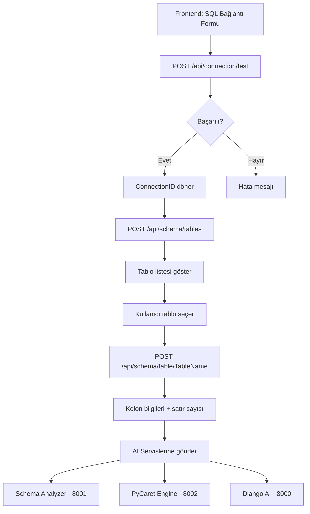

# 🚀 Data Analysis API - Hazır!

## ✅ Başarıyla Oluşturuldu

### 📍 API Bilgileri
- **Port**: 5221
- **Swagger UI**: http://localhost:5221/swagger
- **Health Check**: http://localhost:5221/health
- **Durum**: 🟢 Çalışıyor

---

## 🎯 API Özellikleri

### 1. **Connection Management** (`/api/connection`)
Müşteri SQL Server bağlantı bilgilerini test eder.

**Endpoint**: `POST /api/connection/test`

**Request Body**:
```json
{
  "host": "sql.musteri.com",
  "port": 1433,
  "database": "SalesDB",
  "username": "sa",
  "password": "YourPassword",
  "trustServerCertificate": true
}
```

**Response (Success)**:
```json
{
  "success": true,
  "message": "Connection successful",
  "connectionId": "guid-here"
}
```

**Response (Failure)**:
```json
{
  "success": false,
  "message": "SQL Error: Login failed for user..."
}
```

---

### 2. **Schema Discovery** (`/api/schema`)

#### 📋 Tablo Listesi
**Endpoint**: `POST /api/schema/tables`

**Request Body**: (Aynı connection bilgileri)
```json
{
  "host": "localhost",
  "port": 1433,
  "database": "Northwind",
  "username": "sa",
  "password": "Password123"
}
```

**Response**:
```json
{
  "success": true,
  "count": 13,
  "tables": [
    {
      "tableName": "Customers",
      "schema": "dbo",
      "fullName": "dbo.Customers"
    },
    {
      "tableName": "Orders",
      "schema": "dbo",
      "fullName": "dbo.Orders"
    }
  ]
}
```

---

#### 🔍 Tablo Detayı
**Endpoint**: `POST /api/schema/table/{tableName}`

**URL Parameters**: 
- `tableName`: "dbo.Customers" veya "Customers"

**Request Body**: (Connection bilgileri)

**Response**:
```json
{
  "tableName": "Customers",
  "schema": "dbo",
  "columns": [
    {
      "columnName": "CustomerID",
      "dataType": "nchar",
      "isNullable": false,
      "maxLength": 5
    },
    {
      "columnName": "CompanyName",
      "dataType": "nvarchar",
      "isNullable": false,
      "maxLength": 40
    }
  ],
  "rowCount": 91
}
```

---

## 🏗️ Teknik Detaylar

### Kullanılan Teknolojiler
- **.NET 9** - ASP.NET Core Minimal API
- **Microsoft.Data.SqlClient 6.1.1** - SQL Server bağlantısı
- **Dapper 2.1.66** - Hafif ORM
- **Swashbuckle 9.0.6** - Swagger/OpenAPI dokumentasyonu

### Proje Yapısı
```
Grafirio.DataAnalysis.Api/
├── Features/
│   ├── Connection/
│   │   └── ConnectionEndpoints.cs    # Test connection
│   └── Schema/
│       └── SchemaEndpoints.cs        # Table & schema discovery
├── Models/
│   └── SqlConnectionRequest.cs       # DTOs
└── Program.cs                        # API configuration
```

### Güvenlik
- ✅ CORS aktif (Frontend erişimi için)
- ✅ HTTPS/TLS desteği
- ✅ Connection string güvenli build
- ⏳ TODO: Redis ile session yönetimi
- ⏳ TODO: Connection bilgilerini şifreli saklama

---

## 🎨 Frontend Entegrasyonu

### React'ten Kullanım Örneği

```javascript
// 1. Bağlantı testi
const testConnection = async (connectionInfo) => {
  const response = await axios.post(
    'http://localhost:5221/api/connection/test',
    connectionInfo
  );
  return response.data;
};

// 2. Tabloları listele
const getTables = async (connectionInfo) => {
  const response = await axios.post(
    'http://localhost:5221/api/schema/tables',
    connectionInfo
  );
  return response.data;
};

// 3. Tablo detayı
const getTableSchema = async (tableName, connectionInfo) => {
  const response = await axios.post(
    `http://localhost:5221/api/schema/table/${tableName}`,
    connectionInfo
  );
  return response.data;
};
```

---

## 🔄 İş Akışı



---

## 📊 Service Manager'a Eklendi

Dashboard'da artık **Data Analysis API** görünüyor:
- Kategori: **.NET Microservices**
- Port: **5221**
- Health Check: ✅ Aktif
- Start/Stop: ✅ Çalışıyor

---

## 🚧 Sonraki Adımlar

### Backend (API)
1. ✅ ~~Connection test endpoint~~
2. ✅ ~~Schema discovery (tables)~~
3. ✅ ~~Table detail endpoint~~
4. ⏳ Redis ile session yönetimi
5. ⏳ Sample data endpoint (ilk N satır)
6. ⏳ AI servislerine veri gönderme
7. ⏳ Connection bilgilerini şifreli saklama

### Frontend
1. ⏳ SQL Bağlantı formu tasarımı
2. ⏳ Test connection butonu
3. ⏳ Tablo listesi görünümü
4. ⏳ Tablo seçimi ve detay görüntüleme
5. ⏳ AI analiz başlatma
6. ⏳ Sonuç görüntüleme

---

## 🧪 Test Etme

### Swagger UI
http://localhost:5221/swagger adresinden tüm endpoint'leri test edebilirsiniz.

### Postman/PowerShell Örneği
```powershell
# Test connection
$body = @{
    host = "localhost"
    port = 1433
    database = "Northwind"
    username = "sa"
    password = "YourPassword"
    trustServerCertificate = $true
} | ConvertTo-Json

Invoke-RestMethod -Uri "http://localhost:5221/api/connection/test" `
    -Method Post `
    -Body $body `
    -ContentType "application/json"
```

---

## 📝 Notlar

- API varsayılan olarak **HTTPS** kullanır, ancak development için **HTTP (5221)** de aktif
- Connection timeout: **10 saniye**
- TrustServerCertificate: Default **true** (self-signed sertifikalar için)
- Dapper kullanıldığı için hafif ve hızlı sorgular

---

## 🎉 Özet

✅ **Data Analysis API** tamamen hazır ve çalışıyor!
✅ SQL bağlantı testi yapılabiliyor
✅ Tablo ve kolon bilgileri alınabiliyor
✅ Service Manager'a eklendi
✅ Swagger dokümantasyonu mevcut

**Sıradaki**: Frontend'de SQL bağlantı formu ve tablo listesi ekranını oluşturmak! 🚀
